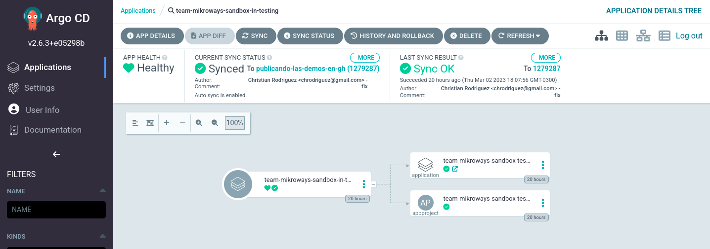
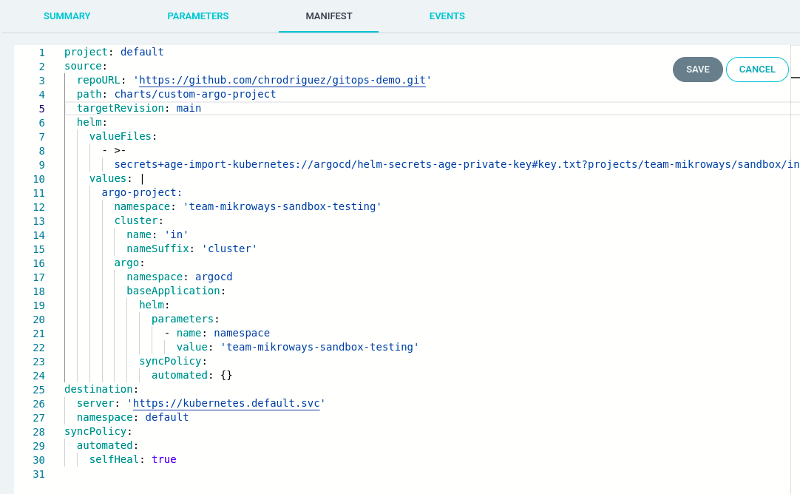
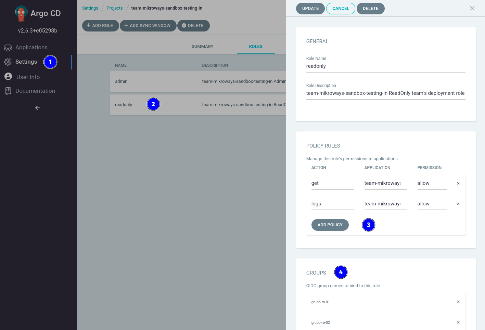
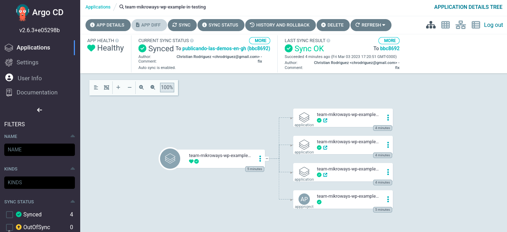
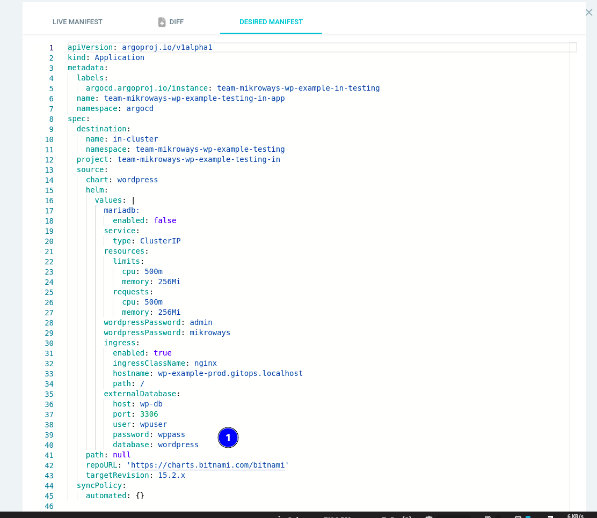

  # Ambientes y despliegues con GitOps

Esta carpeta probablemente sea la más importante en este repositorio. La razón
es que el [Argo CD ApplicationSet configurado en el despliegue original de Argo
CD](../kind#applicationsets-en-tu-repositorio) será el que de vida a cómo se
podrán gestionar las aplicaciones con GitOps.
Lo interesante, es que no necesariamente debe existir un único ApplicationSet,
sino que pueden haber más de uno, donde cada uno de ellos utilice diferentes
estrategias para generar Aplicaciones de Argo CD. En esta prueba que exponemos,
seguimos un caso bastante habitual, donde un organismo mantiene equipos de
desarrolladores, donde cada equipo genera diferentes productos. Luego, esos
productos se despliegan en algún ambiente, donde ese ambiente puede estar en el
mismo u otro cluster y un namespace determinado.

Luego de exponer nuestra idea de cómo proceder, cada quién podrá ir formateando
nuestra propuesta, usando nuevas estrategias o tal vez combinando varias a la
vez. La única restricción que debe considerarse es que dos Aplicaciones de Argo
CD generadas por diferentes ApplicationSet no posean el mismo nombre evitando
así problemas.

## Un ejemplo de cómo organizar este repositorio

Este ejemplo mantiene una carpeta dentro de la actual (donde está este README,
es decir `projects/`), que representará a cada equipo de desarrolladores, por
ejemplo **mikroways-dev-team**. Dentro de ese directorio deberá crearse una
carpeta que identificará algún producto, por ejemplo **product-one**. Luego,
debemos indicar el cluster usado para el despliegue.

> En Argo CD los clusters se dan de alta como se explica en la documentación de
> [`argocd cluster add`](https://argo-cd.readthedocs.io/en/stable/user-guide/commands/argocd_cluster_add/).
> Al agregar un cluster, se le da un nombre que es el que debemos utilizar como
> nombre de la carpeta que identificará el cluster. El nombre **in** hace
> referencia al mismo cluster donde Argo CD fue instalado.

Finalmente, se debe crear dentro de la carpeta correspondiente al
identificador del cluster, otra con el nombre del ambiente, por ejemplo
**testing** o **production**. O sea, lo que tendremos finalmente es una ruta
completa como la siguiente:

```bash
projects/mikroways-dev-team/product-one/in/testing
```

> Observar que el identificador del cluster es **in**

Dentro de la ruta de un equipo, producto, cluster y ambiente, es donde
configuraremos ese ambiente mediante un archivo `values.yaml` que podrá ser
cifrado con alguna clave Age que compartirán quienes gestionan ambientes, y
además, la clave Age que usará Argo CD para descifrar datos sensibles.

> Dependiendo de cómo se configure un ambiente, los datos necesitarán cifrarse o
> no. Esto depende de cuán sensibles sean los datos empleados en el
> `values.yaml`. La solución aquí planteada admite tanto archivos cifrados como
> en texto claro de forma intercambiables.

### Configurando las claves para poder cifrar valores

Como indicamos en la sección anterior, necesitamos disponer de una clave Age
privada (con su pública asociada) para habilitar al equipo que mantenga este
repositorio a trabajar cifrando las configuraciones de cada ambiente. Entonces,
siguiendo la línea de utilizar [direnv](https://direnv.net/) para el seteo de
variables diferentes en cada directorio, creamos entonces en este directorio, un
archivo `.envrc` con el siguiente contenido:

> Los requisitos para tener un cluster ya configurado para usar este flujo, se
> encuentran documentados en la carpeta [`../kind`](../kind)


* **`SOPS_AGE_KEY_FILE`:** requerido. Es el archivo que contiene la clave Age
  privada que compartirán los usuarios de éste repositorio con capacidad de
  cifrar valores. 
* **`SOPS_AGE_RECIPIENTS`:** requerido. Es un arreglo de claves públicas Age:
  una correspondiente a la clave privada mencionada en el punto anterior, la
  otra es la clave pública Age usada por Argo CD y que puede obtenerse como se
  explica en la documentación sobre Argo CD dentro del directorio [`../kind`](../kind/##obtener-la-clave-age-publica-de-argo-cd).

  > Podría ser la misma clave privada Age usada en este directorio que la usada
  > en la carpeta `../kind` si es que quienes mantienen este repositorio son los
  > mismos usuarios que gestionarán el cluster. Sin embargo, se recomienda usar
  > claves diferentes.

* `KUBECONFIG`: no requierido. Sólo si se quiere mantener acceso al mismo
  cluster kind creado en la explicación dentro de la carpeta `../kind` desde el
  actual directorio.

Se aconseja entonces ejecutar en **la carpeta actual, es decir `projects/`** los
siguientes comandos:

```bash
# Enlazamos con las configuraciones de ../kind
ln -fs ../kind/.kube
ln -fs ../kind/.age

# Obtenemos la clave pública Age de ArgoCD
AGE_PK1=$(kubectl --kubeconfig .kube/config -n argocd get secrets \
  -l component=helm-secrets-age -o jsonpath='{.items[0].data.key\.txt}' \
  | base64 -d | grep 'public' | cut -d: -f2 | tr -d ' ')

# Obtenemos la clave pública Age usada por nosotros para cifrar los values
AGE_PK2=$(cat .age/key| grep 'public' | cut -d: -f2 | tr -d ' ')

# Creamos el .envrc con los datos recientemente obtenidos
cat > .envrc <<EOF
export KUBECONFIG=\$PWD/.kube/config
export SOPS_AGE_KEY_FILE=\$PWD/.age/key
export SOPS_AGE_RECIPIENTS=${AGE_PK1},${AGE_PK2}
EOF
```

Al ejecutar el comando anterior, **direnv nos solicitará permitir el `.envrc`
generado**:

```bash
direnv allow
```

A partir de este momento, ya podemos (des)cifrar valores, y conectar al cluster
kind usando `kubectl` sin la opción `--kubeconfig`.

## Despliegues con el marco de trabajo

Mostraremos diferentes usos para entender cómo proponemos manejar los ambientes.
Para ello, enunciaremos los ejemplos aquí propuestos e iremos guiando las
pruebas para poder instanciar cada una de ellas:

* **Crear un ambiente sin despliegues extra:** esta prueba creará un ambiente
  para proceder usando la UI de Argo CD o directamente kubectl. Únicamente
  creará el namespace en el cluster indicado, con o sin quotas. La idea aquí es
  indagar sobre la estructura de las aplicaciones creadas en Argo CD y el
  proyecto.
* **Crear un ambiente con un despliegue de una aplicación sin usar un repositorio
  de GitOps:** en este escenario extenderemos el ejemplo anterior haciendo que
  el ambiente inmediátamente instancie el despliegue de una aplicación. Sin
  embargo, en este ejemplo, no usaremos un repositorio Git donde almacenaremos los
  valores del despliegue sino que quedarán inline, no siendo este caso una buena
  práctica.
* **Crear un ambiente con un despliegue de una aplicación usando un repositorio
  de GitOps:** este ejemplo mejora la propuesta del ejemplo anterior. En este
  caso haremos uso de un nuevo repositorio git donde se almacenarán los valores
  propios del despliegue. Será un ejemplo de aplicar GitOps puro. Veremos aquí
  que el repositorio nuevo Git usado para el despliegue deberá ser configurado
  para que Argo CD pueda clonarlo. Usaremos entonces una característica de
  nuestros charts que nos permiten en esta instancia configurar nuevos
  repositorios privados en Argo CD, con acceso limitado al proyecto.
* **Crear un ambiente con un despliegue de una aplicación usando un repositorio
  de GitOps que utiliza imágenes en una registry privada:** Es similar al caso
  anterior, solo que agregamos la posibilidad de crear un Secret de kubernetes
  que servirá como imagePullSecret de los despliegues que hagamos. De esta
  forma, queda demostrado cómo proceder con los accesos a registries privadas
  facilitándolos desde operaciones para que quienes despliegan, únicamente hagan
  referencia al Secret que les permite descargar imágenes.
* **Crear un ambiente con un despliegue de una aplicación usando un repositorio
  que depende de un chart almacenado en una registry privada:** este escenario
  también nos muestra de cómo proceder para que el proyecto Argo CD creado para
  este despliegue, agregue un repositorio que configure a Argo CD con la
  capacidad de descargar charts desde repositorios privados.
* **Crear un ambiente con un despliegue en un cluster diferente:** como el
  nombre lo indica, veremos cómo configurar un despliegue multicluster.

### Un ambiente sin despliegues

Este escenario nos permite usar nuestro marco de GitOps para crear un nuevo
ambiente que únicamente creará un namespace y un proyecto en ArgoCD. La idea es
que podamos:

* Definir para el proyecto Argo CD quiénes pueden acceder a manipular los
  objetos de Argo CD y quienes únicamente verlo.
* Generar quotas mediante Resource Quotas que limitarán en el namespace creado
  cuántos recursos se pueden utilizar, cantidad de pods, servicios, PVC, etc.
* Establecer valores a asignar a los pods que no seteen recursos como requests y
  limits.

Para continuar con esta prueba, en este directorio crearemos entonces un archivo
siguiendo nuestra propuesta de directorios como se explicó anteriormente: **un
archivo llamado `values.yaml`** dentro de una carpeta con el nombre de un
**equipo**, seguio por el nombre de un **proyecto**, luego el **cluster** y
finalmente el nombre del **ambiente**. Hemos dejado esta estructura creada, con
un archivo que se llama `values.clear.yaml` (que no respeta el nombre necesario
para que Argo CD ApplicationSets lo considere). Entonces, lo que se propone
hacer para que Argo CD cree una aplicación es lo siguiente:

```bash
cd team-mikroways/sandbox/in/testing
cp values.clear.yaml values.yaml
```

> Es importante estar parados en la carpeta donde reside este `README`, es decir
> `projects/`

Lo que estamos haciendo, es crear el archivo`values.yaml` a partir del entregado
como ejemplo en este repositorio. Es posible dejar este archivo en texto claro o
cifrarlo. Por el momento, no lo ciframos para evidenciar que ambos escenarios
funcionan. Para que argo tome ese cambio, como argo constantemente está
observando nuestro repositorio Git vía el Argo CD Application Set, tendremos que
agregar el cambio a git y pushearlo en la rama correspondiente.

```bash
git add .
git commit -m "Add sandbox values.yaml"
git push origin main
```

> Asumimos se está trabajando en la rama main y que Argo CD ApplicationSet está
> observando la misma rama en la que se esté trabajando.

Inmediatamente después de haber hecho el push debemos esperar a que
Argo CD ApplicationSets detecte el cambio (generalmente esto [demora 3
minutos](https://argocd-applicationset.readthedocs.io/en/stable/Generators-Git/#2-configure-applicationset-with-the-webhook-secret-optional)).
Al detectarlo, en la UI de Argo CD veremos que aparece una nueva aplicación en
el projecto default. Esta aplicación creará:

* Una aplicación de ArgoCD que creará un namespace nuevo, con el nombre del
  equipo, seguido por el producto, cluster y ambiente. En nuestro caso
  **team-mikroways-sandbox-in-testing**.
* Un proyecto de Argo CD que limitará los permisos usando los grupos mencionados
  en el `values.yaml` a administradores y readonly users.

Invitamos a que inspeccione bien ambos recursos desde la UI o desde la consola
para evidenciar que:

* La aplicación creada es [team-mikroways-sandbox-in-testing](http://argocd.gitops.localhost/applications/argocd/team-mikroways-sandbox-in-testing).
  Clickeando sobre ella, ingresaremos y veremos dos recursos: una aplicación
  más llamada **team-mikroways-sandbox-testing-in-base** y un proyecto de Argo CD
  llamado **team-mikroways-sandbox-testing-in**, igual que la aplicación actual. 
  Gráficamente es lo que podemos ver en las siguientes capturas:

  

  Si clickeamos sobre [**App details**](http://argocd.gitops.localhost/applications/argocd/team-mikroways-sandbox-in-testing?resource=&node=argoproj.io%2FApplication%2Fargocd%2Fteam-mikroways-sandbox-in-testing%2F0&tab=manifest)
  y seleccionamos la **solapa Manifest** veremos una ventana con el yaml que
  coincide con el generado por el ApplicationSet para nuestra aplicación.

  

  > La razón de por qué el `values.yaml` puede estar o no cifrado se debe a la
  > línea > **`valueFiles`** cuyo arreglo tiene un único elemento que dice
  > `secrets+age-import-kubernetes://argocd/helm-secrets-age-private-key#key.txt?PATH_TO_VALUES_ENC_FILE`.
  > Significando que debe usarse la clave Age indicada por el secreto ubicado en
  > el namespace **argocd** llamado **helm-secrets-age-private-key** en la clave
  > **key.txt** dentro del secret. Luego, con esa clave privada se podrá
  > descifrar el archivo referenciado por `PATH_TO_VALUES_ENC_FILE`.

  Un dato no menor a observar del manifiesto es el chart que Argo CD está
  desplegando. Es el chart que está en **este mismo repositorio**, el repositorio
  privado que has creado a partir del template, que en el ejemplo se ve que es
  https://github.com/chrodriguez/gitops-demo.git, y la carpeta donde está el
  chart: `charts/custom-argo-project`. El valor indicado en
  `PATH_TO_VALUES_ENC_FILE` debe encontrarse relativo al chart, evitando así
  realizar path traversal, es decir que el valor debe estar bajo el mismo
  directorio del chart y no por fuera de él, como los explica este [CVE](https://cve.mitre.org/cgi-bin/cvename.cgi?name=CVE-2022-24348).
  Por esta razón hemos creado un link simbólico desde el [chart](../charts/custom-argo-project)
  a la carpeta de `projects/`.

* Analizamos luego la otra aplicación creada [**team-mikroways-sandbox-testing-in-base**](http://argocd.gitops.localhost/applications/argocd/team-mikroways-sandbox-testing-in-base)
  podemos ver que la misma crea únicamente un Namespace. Si habilitásemos quotas
  y limites, estaremos creando un [ResourceQuota](https://kubernetes.io/docs/concepts/policy/resource-quotas/)
  y un [LimitRange](https://kubernetes.io/docs/concepts/policy/limit-range/) con los datos expresados.

* El proyecto creado configura permisos vía [RBAC de Argo](https://argo-cd.readthedocs.io/en/latest/user-guide/projects/#configuring-rbac-with-projects)
  que pueden verse ingresando a [**Settings > Projects**](http://argocd.gitops.localhost/settings/projects/team-mikroways-sandbox-testing-in),
  seleccionando el proyecto creado, **team-mikroways-sandbox-testing-in** puede
  verse que el proyecto solamente permite el trabajo en el cluster
  **in-cluster** y el namespace **team-mikroways-sandbox-testing**.
* El proyecto además, configura dos roles: **admin y readonly**, visibles
  accediendo a la [**solapa Roles**](http://argocd.gitops.localhost/settings/projects/team-mikroways-sandbox-testing-in?tab=roles).

    > Clickeando en alguno de los roles podrá verse en la ventana contextual que
    > aparece a la dereca de la UI los grupos OIDC que podrán acceder con cada
    > role.

    

    > Los numeros 1 y 2 muestran la secuencia de cómo llegar a ver la ventana
    > anterior. Observar que en 3 se pueden visualizar los permisos para este
    > role, mientas que en 4 el nombre de los grupos de OIDC.

Otra forma de evidenciar cómo es el proyecto creado, es usando kubectl:

```bash
kubectl -n argocd describe appprojects.argoproj.io \
  team-mikroways-sandbox-testing-in
```

Una vez que Argo CD converge, podremos observar con `kubectl` la existencia del
nuevo namespace:

```bash
kubectl get namespaces
kubectl describe namespace team-mikroways-sandbox-testing
```

Cuya salida será algo parecido a:

```
Name:         team-mikroways-sandbox-testing
Labels:       argocd.argoproj.io/instance=team-mikroways-sandbox-testing-in-base
              kubernetes.io/metadata.name=team-mikroways-sandbox-testing
Annotations:  argocd.argoproj.io/sync-wave: -1
Status:       Active

No resource quota.

No LimitRange resource.
```

### Introduciendo un pequeño cambio

Cambiaremos el archivo de `values.yaml` las líneas que deshabilitaban el uso de
**ResourceQuotas** y **LimitRange**:

```
argo-project:
    argo:
        ...
        baseApplication:
            helm:
                values: |
                    quota:
                      enabled: true
                      ...
                    limits:
                      enabled: true

```

Una vez modificado entonces el archivo, agregarlo a git y subir los cambios con
push:

```
git add .
git commit -m "Add sandbox values.yaml"
git push origin main
```

Aguardamos a que Argo CD detecte los cambios (o desde la UI, es posible forzar
un Refresh). Luego podremos evidenciar los cambios con:

```
kubectl describe namespace team-mikroways-sandbox-testing
```

Cuya salida deberá mostrar algo como:

```
Name:         team-mikroways-sandbox-testing
Labels:       argocd.argoproj.io/instance=team-mikroways-sandbox-testing-in-base
              kubernetes.io/metadata.name=team-mikroways-sandbox-testing
Annotations:  argocd.argoproj.io/sync-wave: -1
Status:       Active

Resource Quotas
  Name:                   resource-quota
  Resource                Used  Hard
  --------                ---   ---
  limits.cpu              0     1
  limits.memory           0     2Gi
  persistentvolumeclaims  0     5
  pods                    0     2
  requests.cpu            0     1
  requests.memory         0     1Gi
  resourcequotas          1     1
  services                0     5

Resource Limits
 Type       Resource  Min  Max  Default Request  Default Limit  Max Limit/Request Ratio
 ----       --------  ---  ---  ---------------  ------------- -----------------------
 Container  cpu       -    -    600m             600m           -
 Container  memory    -    -    256Mi            512Mi          -
```

Este escenario de crear un namespace y un proyecto de Argo CD, con o sin quotas,
nos ayudará a poder trabajar con la UI, o desde la cli de kubernetes para
prototipar lo que luego podremos transformar en un _escenario más purista en lo
que respecta a GitOps_.

Esto significa que un usuario con el role OIDC de admin para el proyecto podrá
crear aplicaciones manualmente y verificar que las cosas funcionan desde la UI
mientras por ejemplo, se desarrolla el chart de la aplicación que se desea
desplegar. Una vez finalizado este proceso, se podrá completar este ejemplo
con más valores que permiten enlazar con un flujo completo y puro de GitOps.
El siguiente ejemplo habla un poco más sobre este tema.

### Un ambiente que despliegue una aplicación sin usar un repositorio GitOps

Para que esto sea posible, la idea es desplegar una aplicación cuyos valores
serán manejados directamente desde **este mismo repositorio**, el que has creado
desde el template. Si bien pareciera ser una gran idea esta solución, veremos
que **no es una buena práctica por varias razones**:

* Porque el repositorio donde se versionan los valores es un repositorio
  gestionado por los cluster admins, y ellos no necesariamente deben
  conocer los detalles de cómo desplegar una aplicación.
* Porque los valores aquí utilizados, incluso los cifrados, podrán verse en el
  campo `.spec` de los manifiestos de las aplicaciones Argo CD desde la UI o
  cli. O sea que si bien podremos cifrar el archivo de `values.yaml`, luego al
  utilizar estos valores de forma **inline en el chart** dentro de la
  aplicación Argo CD, entonces estos datos serán visibles en claro. Esto no
  sucede cuando se utilizan otras estrategias como explicaremos luego.

Por estas razones, mostraremos este escenario simplemente para entenderlo desde
la propia experiencia, pero **desaconsejamos su uso**.

Como ya sucedió en el escenario anterior, planteamos un nuevo nombre de ambiente
para esta prueba. En este caso desplegaremos el conocido wordpress, que a su vez
nos permite mostrar cómo manejar la base de datos que, debería existir antes de
desplegar wordpress. 

> El chart que usaremos de [wordpress es el de
> bitnami](https://github.com/bitnami/charts/tree/main/bitnami/wordpress). El
> mismo ofrece instalar una base de datos que lo haría en el mismo despliegue
> del wordpress. Sin embargo, si bien este chart de wordpress no utiliza un helm
> hook, en otros escenarios las migraciones de la base de datos se corren en un
> hook de pre-upgrade, pre-install. En estos casos, la base de datos debe
> existir antes que el despliegue del wordpress. Por ello usaremos el escenario
> de crear un requerimiento (con las base de datos) para el despliegue del
> wordpress a modo de ejemplo (aunque en este escenario no sea necesario).

El nuevo despliegue será también parte del equipo **team-mikroways**, llamando al 
proyecto **wp-example**. También usaremos el cluster **in** y llamaremos al
ambiente **testing**. Para que el despliegue se efectivice, crearemos el archivo
`values.yaml` en la carpeta `projects/team-mikroways/wp-example/in/testing`:

```bash
cd team-mikroways/wp-example/in/testing
sops -e values.clear.yaml > values.yaml
```

> Es importante estar parados en la carpeta donde reside este `README`, es decir
> `projects/`

O sea, el resultado es obtener un archivo **cifrado `values.yaml`**. Lo ciframos
porque estamos seteando las contraseñas de la base de datos, el usuario
**admin** y la contraseña del usuario de wordpress. Pueden leerse estos valores
para luego probar nuestro despliegue. Para que argo tome ese cambio, tendremos
que agregar el cambio a git y pushearlo en la rama correspondiente.

```bash
git add .
git commit -m "Add wp-example crypted values.yaml"
git push origin main
```

Inmediatamente después de haber hecho el push debemos esperar a que
Argo CD ApplicationSets detecte el cambio. Al detectarlo, en la UI de Argo CD
veremos que aparece una nueva aplicación en el projecto default. Esta aplicación
creará ahora dos aplicaciones más respecto del escenario anterior. Ahora tenemos
los [siguientes recursos](http://argocd.gitops.localhost/applications/argocd/team-mikroways-wp-example-in-testing?view=tree&resource=):

* La aplicación base que creará el namespace [**team-mikroways-wp-example-in-testing-basE**](HTTP://ARGOCD.Gitops.localhost/applications/argocd/team-mikroways-wp-example-testing-in-base).
* El proyecto de Argo CD que limitará los permisos llamado igual que la
  aplicación anterior.
* Una aplicación que creará una base de datos MySQL llamada
  [**team-mikroways-wp-example-in-testing-reqs**](http://argocd.gitops.localhost/applications/argocd/team-mikroways-wp-example-testing-in-reqs).
* La aplicación propiamente dicha, el wordpress, llamada
  [**team-mikroways-wp-example-in-testing-app**](http://argocd.gitops.localhost/applications/argocd/team-mikroways-wp-example-testing-in-app).



**Es importante destacar, que si bien en este repositorio se mantienen los datos
cifrados, un usuario con permisos de read-only podrá observar el manifiesto de
la aplicación
[team-mikroways-wp-example-in-testing-app](http://argocd.gitops.localhost/applications/argocd/team-mikroways-wp-example-testing-in-app?resource=&node=argoproj.io%2FApplication%2Fargocd%2Fteam-mikroways-wp-example-testing-in-app%2F0&tab=manifest),
y ver los datos sensibles como se muestra en la siguiente imagen.**



> El número 1 de la imagen nos muestra la exposición de datos sensibles.

Podemos probar acceder al wordpress usando la URL configurada en el Ingress.
Para obtenerla podemos:

* Acceder desde la cli: `kubectl get ingress -A`
* Acceder desde la [UI de Argo CD a la aplicación del
  wordpress](http://argocd.gitops.localhost/applications/argocd/team-mikroways-wp-example-testing-in-app)
y clickear sobre el ícono del ingress que nos llevará al sitio.

Las URLs del wordpress son:

* Para visualizar el sitio: http://wp-example-testing.gitops.localhost/
* Para administrarlo http://wp-example-testing.gitops.localhost/login 
  * **Usuario:** user
  * **Contraseña:** mikroways

> Todos los datos pueden leerse del `values.yaml` cifrado previamente

### Un ambiente con un despliegue usando un repositorio externo de GitOps

En este caso, veremos como rediseñar el ejemplo inmediatamente anterior, pero de
una forma más segura. Para ello, cada quien deberá crear un repositorio privado
a partir del [template de repositorios gitops provisto](https://github.com/Mikroways/argo-gitops-private-template).

Leer detenidamente la documentación del repositorio antes indicado, y luego
proceder con el ejemplo de [**un repositorio de GitOps**](https://github.com/Mikroways/argo-gitops-private-template/tree/main/gitops-wordpress)
que se corresponde con un wordpress similar al del escenario anterior, pero que
lo usaremos para el ambiente de producción.

Los pasos para hacer funcionar este nuevo ambiente requiere entonces ingresar a
la carpeta:

```bash
cd team-mikroways/wp-example/in/prod
```

> Es importante estar parados en la carpeta donde reside este `README`, es decir
> `projects/`

Primero analizaremos el archivo descifrado entregado llamado
`values.clear.yaml`. Este archivo configura un ambiente, y como mencionamos ya
al principio de éste readme, un ambiente define:

* Un proyecto de Argo CD con permisos para diferentes grupos. Ahora veremos que
  además, podemos dar de alta nuevos repositorios en Argo CD: repositorios git
  privados como el que usaremos para crear nuestras aplicaciones GitOps, que en
  este caso son el wordpress de producción y su base de datos.
* Una aplicación de requerimientos, que si se lee el `values.clear.yaml`, puede
  observarse que la URL git del repositorio de esta aplicación dice **CHANGEME**.
  La idea es que cada quien la modifique apuntando al repositorio que haya usado
  en la creación del template como se explica en [este repositorio](https://github.com/Mikroways/argo-gitops-private-template).
* La aplicación en sí, el wordpress de producción que también requiere cambiar
  el repositorio que utiliza **CHANGEME**.

> A modo de simplificación, ambas aplicaciones, la de requerimientos y el
> wordpress figuran en un mismo repositorio git, cada uno en una carpeta
> diferente. Prestar especial atención a la configuración de cada aplicación en
> el `values.clear.yaml`, específicamente a los campos **`targetRevision`** y 
> **`path`**, que justamente nos permite mantener aplicaciones que podrían estar
> en diferentes ramas o directorios para realizar pruebas.

Una vez el archivo `values.clear.yaml` se haya modificado acorde al repositorio
privado adecuado, procedemos a cifrar este archivo y subimos los cambios:

```bash
sops -e values.clear.yaml > values.yaml
git add .
git commit -m "Add wp production environment crypted values.yaml"
git push origin main
```

Aguardamos a que Argo CD ApplicationSets tome los cambios y veremos que aparecen
las aplicaciones. Ingresamos a visualizar las aplicaciones del wordpress y base
de datos:

* [team-mikroways-wp-example-prod-in-reqs](http://argocd.gitops.localhost/applications/argocd/team-mikroways-wp-example-prod-in-reqs)
* [team-mikroways-wp-example-prod-in-app](http://argocd.gitops.localhost/applications/argocd/team-mikroways-wp-example-prod-in-app)

Puede que estén dando error debido al repositorio en cuestión (el
repositorio referenciado por nuestra aplicación, [creado a partir del template](https://github.com/Mikroways/argo-gitops-private-template.git)).
Al ser un repositorio privado, puede que sea necesario dar de alta el
repositorio en Argo CD, como un [**scoped repository**](https://argo-cd.readthedocs.io/en/stable/user-guide/projects/#project-scoped-repositories-and-clusters).
El ejemplo entregado considera tal configuración. Si se utiliza un repositorio
que requiere crear este secreto, puede que Argo CD necesite que se presione el
botón **refrescar de cada aplicación** para que utilice las credenciales
recientemente creadas.

Las URLs del wordpress son:

* Para visualizar el sitio: http://wp-example-prod.gitops.localhost/
* Para administrarlo http://wp-example-prod.gitops.localhost/login
  * **Usuario:** user
  * **Contraseña:** mikroways-production!

> Todos los datos pueden no ser los indicados, porque surgen de los valores
> versionados en el repositorio template, en el
> [`values.yaml`](https://github.com/Mikroways/argo-gitops-private-template/blob/main/gitops-wordpress/wp/values.yaml) y
> [`secrets.yaml`](https://github.com/Mikroways/argo-gitops-private-template/blob/main/gitops-wordpress/wp/secrets.clear.yaml).
> Aunque estos valores, pudieron cambiarse en su propio repositorio.

Ahora se puede observar que las aplicaciones nuevas, a diferencias de las
creadas en el ejemplo anterior, no exponen ningún dato sensible.

### Un ambiente con un repositorio externo de GitOps que utiliza registry privada

Este escenario es similar al inmediatamente anterior en el sentido de utilizar
un repositorio GitOps externo. De hecho en este caso, también usaremos el
repositorio privado [creado a partir del template](https://github.com/Mikroways/argo-gitops-private-template.git).
Sin embargo, en este ejemplo el despliegue tiene un requerimiento adicional a los
ejemplos de Wordpress previos: la imagen de contenedores empleada no está en una
registry pública. Para ello, el nuevo ejemplo, creará una imagen de un nginx
personalizado utilizando pipelines para pushearla a alguna registry privada.

Para continuar, sugerimos seguir las indicaciones mencionadas en la
[**documentación del repositorio de GitOps con la registry privada**](https://github.com/Mikroways/argo-gitops-private-template/tree/main/gitops-custom-nginx).

Una vez completados los pasos y modificado el repositorio de GitOps propio del
nginx personalizado, procederemos a crear un nuevo team, proyecto y ambiente:

```bash
cd team-webmasters/www/in/testing
```

> Es importante estar parados en la carpeta donde reside este `README`, es decir
> `projects/`. Notar que creamos un nuevo equipo **team-webmasters**, donde
> trabajaremos en el proyecto **www**, en el cluster **in**, ambiente **testing**.

Al ingresar en el directorio mencionado, primero analizaremos el archivo
descifrado entregado llamado `values.clear.yaml`. Este archivo configura el
ambiente como lo hicimos anteriormente, por lo que su lectura debe ser familiar.
Es importante **leer los comentarios** y completar aquellos campos que están
cargados con la palabra **CHANGEME**. Las credenciales de la registry deben
enviarse en base64 como se explica en [la documentación de nuestro chart
base](https://github.com/Mikroways/argo-gitops-flow/tree/main/charts/argo-base-app#registry-secret).

> Podrá observar que estamos usando un único repositorio para todos los
> ejemplos. No recomendamos esta práctica en un ambiente productivo.

Una vez el archivo `values.clear.yaml` se haya modificado acorde al repositorio
privado adecuado, procedemos a cifrar este archivo y subimos los cambios:

```bash
sops -e values.clear.yaml > values.yaml
git add .
git commit -m "Add nginx custom environment crypted values.yaml"
git push origin main
```

Aguardamos a que Argo CD ApplicationSets tome los cambios y veremos que aparecen
las aplicaciones. Ingresamos a visualizar las aplicaciones del nginx:

* [team-webmasters-www-in-testing](http://argocd.gitops.localhost/applications/team-webmasters-www-in-testing)
* [team-webmasters-www-in-testing-base](http://argocd.gitops.localhost/applications/argocd/team-webmasters-www-testing-in-base): es en esta aplicación donde se crea el imagePullSecret.
* [team-webmasters-www-in-testing-app](http://argocd.gitops.localhost/applications/argocd/team-webmasters-www-testing-in-app): esta aplicación usa ese secret.

> Como se mencionó en el ejemplo anterior, puede que la última aplicación esté
> dando error debido al repositorio en cuestión (el repositorio referenciado por
> nuestra aplicación, [creado a partir del template](https://github.com/Mikroways/argo-gitops-private-template.git)).
> Al ser un repositorio privado, puede que sea necesario dar de alta el
> repositorio en Argo CD, como un [**scoped repository**](https://argo-cd.readthedocs.io/en/stable/user-guide/projects/#project-scoped-repositories-and-clusters).
> El ejemplo entregado considera tal configuración. Si se utiliza un repositorio
> que requiere crear este secreto, puede que Argo CD necesite que se presione el
> botón **refrescar de cada aplicación** para que utilice las credenciales
> recientemente creadas.

Si nada fue modificado del ejemplo entregado, entonces podrá acceder al flamante
nginx personalizado usando la URL del ingress creado
http://nginx-custom.private-registry.gitops.localhost/.

> La aplicación será una réplica del sitio web de
> [Mikroways](https://mikroways.net). Pruebe navegar el sitio para verificar su
> adecuado funcionamiento.

### Un ambiente con un repositorio externo de GitOps que utiliza un chart privado

Este ejemplo cambia de problema: en el ejemplo anterior vimos como lidiar con
una registry de contenedores privada usando imagePullSecrets, ahora trabajaremos
con un helm chart que se almacena en una registry privada usando:

* Un repositorio de helm estándar
* Una registry de contenedores como repositorio de helm charts en formato OCI

La idea es evidenciar cómo configurar este repositorio desde nuestro flujo, así
como los detalles que deben considerarse. Por ello, hemos dejado en
[**la documentación del repositorio de GitOps con un chart privado**](https://github.com/Mikroways/argo-gitops-private-template/tree/main/gitops-private-chart).
Con el chart almacenado en un repositorio y una registry OCI, separamos esta
prueba en dos. Ambos despliegues usarán el mismo chart, pero almacenado en dos
lugares diferentes, mostrando justamente como varía uno del otro y remarcando
los posibles problemas que tenemos si usamos registries OCI. Los despliegues
corresponden a la misma imagen del nginx personalizado usada en el ejemplo
anterior, pero ahora con un chart privado. Por ello, la misma registry privada
usada en el ejemplo anterior será usada en este paso.

#### Usando un repositorio de Helm charts

Este despliegue lo llamaremos **www-private-chart** y será también parte del
equipo **team-webmasters**. Por ello, accedemos a la carpeta correspondiente:

```bash
cd projects/team-webmasters/www-private-chart/in/testing
```
> Es importante estar parados en la carpeta donde reside este `README`, es decir
> `projects/`.

Al ingresar en el directorio mencionado, primero analizaremos el archivo
descifrado entregado llamado `values.clear.yaml`. Este archivo configura el
ambiente como lo hicimos anteriormente, por lo que su lectura debe ser familiar.
Es importante **leer los comentarios** y completar aquellos campos que están
cargados con la palabra **CHANGEME**. Las credenciales de la registry deben
enviarse en base64 como se explica en [la documentación de nuestro chart
base](https://github.com/Mikroways/argo-gitops-flow/tree/main/charts/argo-base-app#registry-secret)
(incluso puede usarse el mismo valor que en el ejemplo anterior). Luego podemos
ver que tendremos que definir al menos dos repositrios:

* Uno para que Argo CD pueda clonar nuestro repositorio (que como ya se
  mencionó, si este repositorio no fue creado durante la instalación de Argo CD,
  entonces en esta instancia podemos crear un scoped repository).
* Otro de tipo helm para que Argo CD pueda dar de alta un repositorio en helm
  privado. Los datos de este repositorio helm pueden obtenerse como se explica
  en [la documentación donde se generan los charts](https://github.com/Mikroways/argo-gitops-private-template/tree/main/charts#helm-repositories).

Una vez el archivo `values.clear.yaml` se haya modificado acorde al repositorio
privado adecuado, procedemos a cifrar este archivo y subimos los cambios:

```bash
sops -e values.clear.yaml > values.yaml
git add .
git commit -m "Add nginx custom with private registry crypted values.yaml"
git push origin main
```

Aguardamos a que Argo CD ApplicationSets tome los cambios y veremos que aparecen
las aplicaciones. Si nada fue modificado del ejemplo entregado, y Argo CD logra
sincronizar todas las aplicaciones, entonces podrá acceder al nuevo despliegue
usando la URL del ingress creado mikroways-website.gitops.localhost.

> La aplicación será una réplica del sitio web de
> [Mikroways](https://mikroways.net). Pruebe navegar el sitio para verificar su
> adecuado funcionamiento.

#### Usando un repositorio de Helm charts

Este despliegue lo llamaremos **www-private-chart** y será también parte del
equipo **team-webmasters**. Por ello, accedemos a la carpeta correspondiente:

```bash
cd projects/team-webmasters/www-private-chart/in/testing
```
> Es importante estar parados en la carpeta donde reside este `README`, es decir
> `projects/`.

Al ingresar en el directorio mencionado, primero analizaremos el archivo
descifrado entregado llamado `values.clear.yaml`. Este archivo configura el
ambiente como lo hicimos anteriormente, por lo que su lectura debe ser familiar.
Es importante **leer los comentarios** y completar aquellos campos que están
cargados con la palabra **CHANGEME**. Las credenciales de la registry deben
enviarse en base64 como se explica en [la documentación de nuestro chart
base](https://github.com/Mikroways/argo-gitops-flow/tree/main/charts/argo-base-app#registry-secret)
(incluso puede usarse el mismo valor que en el ejemplo anterior). Luego podemos
ver que tendremos que definir al menos dos repositrios:

* Uno para que Argo CD pueda clonar nuestro repositorio (que como ya se
  mencionó, si este repositorio no fue creado durante la instalación de Argo CD,
  entonces en esta instancia podemos crear un scoped repository).
* Otro de tipo helm para que Argo CD pueda dar de alta un repositorio en helm
  privado. Los datos de este repositorio helm pueden obtenerse como se explica
  en [la documentación donde se generan los charts](https://github.com/Mikroways/argo-gitops-private-template/tree/main/charts#helm-repositories).

Una vez el archivo `values.clear.yaml` se haya modificado acorde al repositorio
privado adecuado, procedemos a cifrar este archivo y subimos los cambios:

```bash
sops -e values.clear.yaml > values.yaml
git add .
git commit -m "Add nginx custom with private registry crypted values.yaml"
git push origin main
```

Aguardamos a que Argo CD ApplicationSets tome los cambios y veremos que aparecen
las aplicaciones. Si nada fue modificado del ejemplo entregado, y Argo CD logra
sincronizar todas las aplicaciones, entonces podrá acceder al nuevo despliegue
usando la URL del ingress creado mikroways-website.gitops.localhost.

> La aplicación será una réplica del sitio web de
> [Mikroways](https://mikroways.net). Pruebe navegar el sitio para verificar su
> adecuado funcionamiento.
